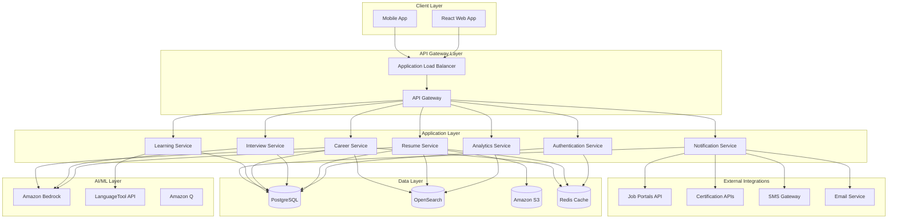
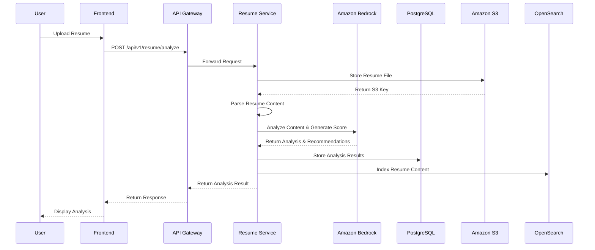
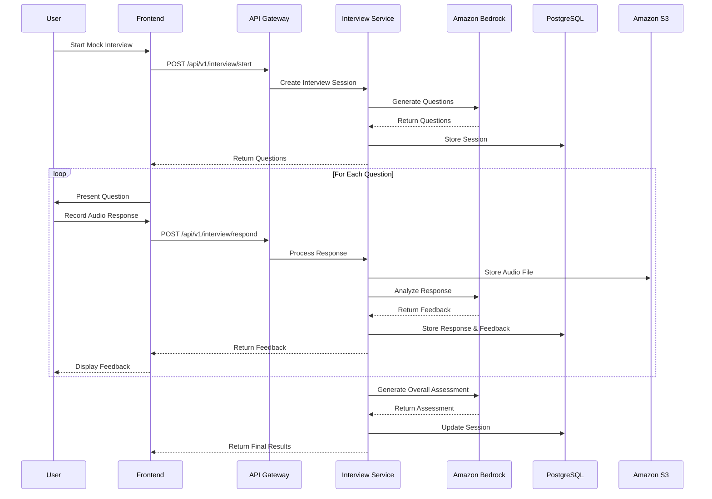
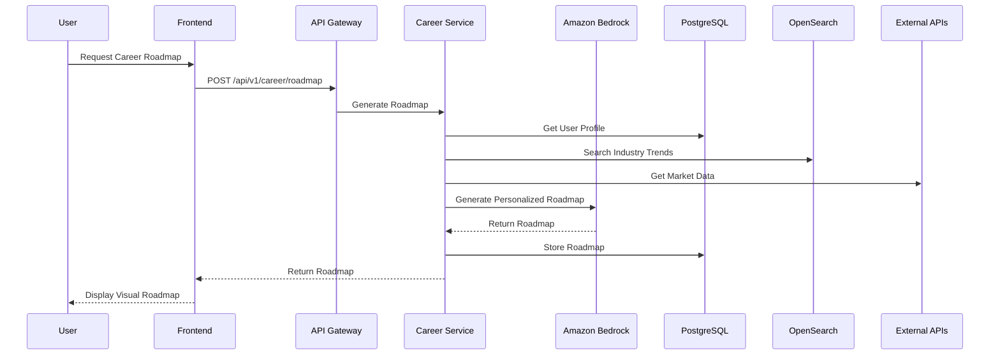
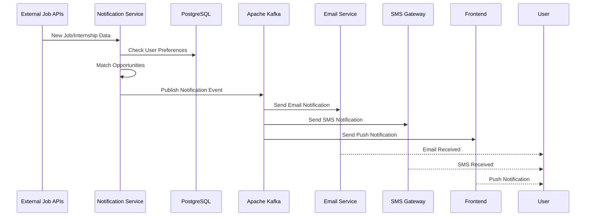

# Design Document: AI CAREER AGENT

## Overview

AI CAREER AGENT is a comprehensive career guidance platform designed for the Indian market, serving students and early professionals across diverse educational backgrounds. The platform leverages modern cloud-native architecture with AI-powered features to provide personalized career development tools at scale.

### Key Design Principles

- **India-First Approach**: Optimized for Indian educational systems, job markets, and cultural context
- **Scalability**: Built to serve millions of users across India with consistent performance
- **AI-Driven Personalization**: Leveraging Amazon Bedrock for intelligent career guidance
- **Microservices Architecture**: Modular, maintainable, and independently scalable services
- **Security-First**: Comprehensive security measures for user data protection
- **Multi-Language Support**: English and Hindi language support throughout the platform

## Architecture

### High-Level Architecture



### Microservices Architecture

#### 1. Authentication Service
- **Technology**: Java 17 + Spring Boot + Spring Security
- **Responsibilities**:
  - User registration and login
  - JWT token management
  - Social authentication (Google, LinkedIn)
  - Role-based access control
  - Password management and security
- **Database**: PostgreSQL (user profiles, credentials)
- **Cache**: Redis (session management, token blacklisting)

#### 2. Resume Service
- **Technology**: Java 17 + Spring Boot + Spring AI
- **Responsibilities**:
  - Resume parsing and analysis
  - ATS score calculation
  - AI-powered resume enhancement
  - File storage and retrieval
  - Resume templates and formatting
- **AI Integration**: Amazon Bedrock (Claude/Titan models)
- **Database**: PostgreSQL (resume metadata, analysis results)
- **Storage**: Amazon S3 (resume files)
- **Search**: OpenSearch (resume content indexing)

#### 3. Interview Service
- **Technology**: Java 17 + Spring Boot + Spring AI
- **Responsibilities**:
  - Mock interview generation
  - Speech analysis and feedback
  - Interview performance tracking
  - Question bank management
  - Progress analytics
- **AI Integration**: Amazon Bedrock (conversation AI, analysis)
- **Database**: PostgreSQL (interview sessions, feedback)
- **Storage**: Amazon S3 (audio recordings)

#### 4. Career Service
- **Technology**: Java 17 + Spring Boot + Spring AI
- **Responsibilities**:
  - Career roadmap generation
  - Mind map visualization
  - Skills assessment
  - Industry trend analysis
  - Career path recommendations
- **AI Integration**: Amazon Bedrock (career analysis, recommendations)
- **Database**: PostgreSQL (career data, user assessments)
- **Search**: OpenSearch (career opportunities, skills matching)

#### 5. Learning Service
- **Technology**: Java 17 + Spring Boot
- **Responsibilities**:
  - English and Aptitude modules
  - Progress tracking
  - Adaptive learning algorithms
  - Grammar checking integration
  - Certificate generation
- **AI Integration**: LanguageTool API (grammar checking)
- **Database**: PostgreSQL (learning content, progress)

#### 6. Notification Service
- **Technology**: Java 17 + Spring Boot + Spring Cloud Stream
- **Responsibilities**:
  - Real-time notifications
  - Multi-channel delivery (email, SMS, push)
  - Notification preferences management
  - External API integrations
  - Delivery tracking and analytics
- **Database**: PostgreSQL (notification logs, preferences)
- **Message Queue**: Apache Kafka (event streaming)

#### 7. Analytics Service
- **Technology**: Java 17 + Spring Boot + Spring Data
- **Responsibilities**:
  - User behavior tracking
  - Platform performance monitoring
  - Business intelligence dashboards
  - Predictive analytics
  - Reporting and insights
- **Database**: OpenSearch (analytics data, logs)
- **Visualization**: Grafana dashboards

## Components and Interfaces

### Core Components

#### 1. Resume Analyzer Component
```java
@Component
public class ResumeAnalyzer {
    private final BedrockChatClient chatClient;
    private final DocumentParser documentParser;
    private final ATSScoreCalculator atsCalculator;
    
    public ResumeAnalysisResult analyzeResume(MultipartFile resumeFile) {
        // Parse resume content
        ParsedResume parsed = documentParser.parse(resumeFile);
        
        // Calculate ATS score
        ATSScore score = atsCalculator.calculate(parsed);
        
        // Generate AI recommendations
        String recommendations = chatClient.call(
            "Analyze this resume and provide improvement suggestions: " + 
            parsed.getContent()
        );
        
        return ResumeAnalysisResult.builder()
            .atsScore(score)
            .recommendations(recommendations)
            .parsedContent(parsed)
            .build();
    }
}
```

#### 2. Mock Interview Engine
```java
@Component
public class MockInterviewEngine {
    private final BedrockChatClient chatClient;
    private final SpeechAnalyzer speechAnalyzer;
    
    public InterviewSession startInterview(InterviewType type, UserProfile profile) {
        // Generate contextual questions
        List<Question> questions = generateQuestions(type, profile);
        
        return InterviewSession.builder()
            .sessionId(UUID.randomUUID())
            .questions(questions)
            .currentQuestionIndex(0)
            .startTime(Instant.now())
            .build();
    }
    
    public FeedbackResult analyzResponse(String audioResponse, Question question) {
        // Analyze speech patterns and content
        SpeechAnalysis speechAnalysis = speechAnalyzer.analyze(audioResponse);
        
        // Generate AI feedback
        String feedback = chatClient.call(
            "Evaluate this interview response for question: " + question.getText() + 
            " Response: " + speechAnalysis.getTranscript()
        );
        
        return FeedbackResult.builder()
            .speechAnalysis(speechAnalysis)
            .contentFeedback(feedback)
            .score(calculateScore(speechAnalysis, feedback))
            .build();
    }
}
```

#### 3. Career Roadmap Generator
```java
@Component
public class CareerRoadmapGenerator {
    private final BedrockChatClient chatClient;
    private final SkillsDatabase skillsDatabase;
    private final IndustryTrendsService trendsService;
    
    public CareerRoadmap generateRoadmap(UserProfile profile, CareerGoal goal) {
        // Analyze current skills and target role
        SkillGap skillGap = analyzeSkillGap(profile, goal);
        
        // Get industry trends
        IndustryTrends trends = trendsService.getCurrentTrends(goal.getIndustry());
        
        // Generate AI-powered roadmap
        String roadmapPrompt = buildRoadmapPrompt(profile, goal, skillGap, trends);
        String aiRoadmap = chatClient.call(roadmapPrompt);
        
        return CareerRoadmap.builder()
            .milestones(parseMilestones(aiRoadmap))
            .skillGap(skillGap)
            .estimatedTimeline(calculateTimeline(aiRoadmap))
            .recommendations(parseRecommendations(aiRoadmap))
            .build();
    }
}
```

### API Interfaces

#### REST API Endpoints

```java
@RestController
@RequestMapping("/api/v1/resume")
public class ResumeController {
    
    @PostMapping("/analyze")
    public ResponseEntity<ResumeAnalysisResult> analyzeResume(
            @RequestParam("file") MultipartFile file,
            @AuthenticationPrincipal UserDetails user) {
        // Implementation
    }
    
    @PostMapping("/enhance")
    public ResponseEntity<EnhancedResume> enhanceResume(
            @RequestBody ResumeEnhancementRequest request,
            @AuthenticationPrincipal UserDetails user) {
        // Implementation
    }
}

@RestController
@RequestMapping("/api/v1/interview")
public class InterviewController {
    
    @PostMapping("/start")
    public ResponseEntity<InterviewSession> startInterview(
            @RequestBody StartInterviewRequest request,
            @AuthenticationPrincipal UserDetails user) {
        // Implementation
    }
    
    @PostMapping("/respond")
    public ResponseEntity<FeedbackResult> submitResponse(
            @RequestBody InterviewResponse response,
            @AuthenticationPrincipal UserDetails user) {
        // Implementation
    }
}
```

#### WebSocket Interfaces for Real-time Features

```java
@Controller
public class CareerBotWebSocketController {
    
    @MessageMapping("/chat")
    @SendTo("/topic/responses")
    public ChatResponse handleChatMessage(ChatMessage message) {
        // Process chat message with AI
        return careerBotService.processMessage(message);
    }
}
```
## Data Models

### Core Data Entities

#### User Profile
```java
@Entity
@Table(name = "user_profiles")
public class UserProfile {
    @Id
    private UUID id;
    
    @Column(nullable = false, unique = true)
    private String email;
    
    @Column(nullable = false)
    private String firstName;
    
    @Column(nullable = false)
    private String lastName;
    
    @Enumerated(EnumType.STRING)
    private EducationBackground educationBackground;
    
    @ElementCollection
    @Enumerated(EnumType.STRING)
    private Set<CareerInterest> careerInterests;
    
    @OneToMany(mappedBy = "user", cascade = CascadeType.ALL)
    private List<Resume> resumes;
    
    @OneToMany(mappedBy = "user", cascade = CascadeType.ALL)
    private List<InterviewSession> interviewSessions;
    
    @OneToOne(mappedBy = "user", cascade = CascadeType.ALL)
    private CareerProfile careerProfile;
    
    // Getters, setters, constructors
}
```

#### Resume Entity
```java
@Entity
@Table(name = "resumes")
public class Resume {
    @Id
    private UUID id;
    
    @ManyToOne(fetch = FetchType.LAZY)
    @JoinColumn(name = "user_id")
    private UserProfile user;
    
    @Column(nullable = false)
    private String fileName;
    
    @Column(nullable = false)
    private String s3Key;
    
    @Column(columnDefinition = "TEXT")
    private String parsedContent;
    
    @Embedded
    private ATSScore atsScore;
    
    @Column(columnDefinition = "TEXT")
    private String aiRecommendations;
    
    @CreationTimestamp
    private Instant createdAt;
    
    @UpdateTimestamp
    private Instant updatedAt;
    
    // Getters, setters, constructors
}
```

#### Interview Session
```java
@Entity
@Table(name = "interview_sessions")
public class InterviewSession {
    @Id
    private UUID id;
    
    @ManyToOne(fetch = FetchType.LAZY)
    @JoinColumn(name = "user_id")
    private UserProfile user;
    
    @Enumerated(EnumType.STRING)
    private InterviewType type;
    
    @OneToMany(mappedBy = "session", cascade = CascadeType.ALL)
    private List<InterviewQuestion> questions;
    
    @OneToMany(mappedBy = "session", cascade = CascadeType.ALL)
    private List<InterviewResponse> responses;
    
    @Embedded
    private InterviewScore overallScore;
    
    @Column(columnDefinition = "TEXT")
    private String aiFeedback;
    
    private Instant startTime;
    private Instant endTime;
    
    @Enumerated(EnumType.STRING)
    private SessionStatus status;
    
    // Getters, setters, constructors
}
```

#### Career Roadmap
```java
@Entity
@Table(name = "career_roadmaps")
public class CareerRoadmap {
    @Id
    private UUID id;
    
    @OneToOne(fetch = FetchType.LAZY)
    @JoinColumn(name = "user_id")
    private UserProfile user;
    
    @Column(nullable = false)
    private String targetRole;
    
    @Column(nullable = false)
    private String industry;
    
    @OneToMany(mappedBy = "roadmap", cascade = CascadeType.ALL)
    @OrderBy("sequenceOrder ASC")
    private List<CareerMilestone> milestones;
    
    @ElementCollection
    private List<String> requiredSkills;
    
    @ElementCollection
    private List<String> recommendedCertifications;
    
    private Integer estimatedTimelineMonths;
    
    @Column(columnDefinition = "TEXT")
    private String aiGeneratedContent;
    
    @CreationTimestamp
    private Instant createdAt;
    
    @UpdateTimestamp
    private Instant updatedAt;
    
    // Getters, setters, constructors
}
```

### Database Schema Design

#### PostgreSQL Schema Structure

```sql
-- Users and Authentication
CREATE TABLE user_profiles (
    id UUID PRIMARY KEY DEFAULT gen_random_uuid(),
    email VARCHAR(255) UNIQUE NOT NULL,
    first_name VARCHAR(100) NOT NULL,
    last_name VARCHAR(100) NOT NULL,
    education_background VARCHAR(50) NOT NULL,
    phone_number VARCHAR(20),
    date_of_birth DATE,
    location VARCHAR(100),
    created_at TIMESTAMP WITH TIME ZONE DEFAULT NOW(),
    updated_at TIMESTAMP WITH TIME ZONE DEFAULT NOW()
);

-- Resume Management
CREATE TABLE resumes (
    id UUID PRIMARY KEY DEFAULT gen_random_uuid(),
    user_id UUID NOT NULL REFERENCES user_profiles(id),
    file_name VARCHAR(255) NOT NULL,
    s3_key VARCHAR(500) NOT NULL,
    parsed_content TEXT,
    ats_score_overall INTEGER,
    ats_score_keywords INTEGER,
    ats_score_format INTEGER,
    ats_score_experience INTEGER,
    ai_recommendations TEXT,
    created_at TIMESTAMP WITH TIME ZONE DEFAULT NOW(),
    updated_at TIMESTAMP WITH TIME ZONE DEFAULT NOW()
);

-- Interview Sessions
CREATE TABLE interview_sessions (
    id UUID PRIMARY KEY DEFAULT gen_random_uuid(),
    user_id UUID NOT NULL REFERENCES user_profiles(id),
    interview_type VARCHAR(50) NOT NULL,
    overall_score INTEGER,
    communication_score INTEGER,
    technical_score INTEGER,
    confidence_score INTEGER,
    ai_feedback TEXT,
    start_time TIMESTAMP WITH TIME ZONE,
    end_time TIMESTAMP WITH TIME ZONE,
    status VARCHAR(20) DEFAULT 'IN_PROGRESS',
    created_at TIMESTAMP WITH TIME ZONE DEFAULT NOW()
);

-- Career Planning
CREATE TABLE career_roadmaps (
    id UUID PRIMARY KEY DEFAULT gen_random_uuid(),
    user_id UUID UNIQUE NOT NULL REFERENCES user_profiles(id),
    target_role VARCHAR(200) NOT NULL,
    industry VARCHAR(100) NOT NULL,
    estimated_timeline_months INTEGER,
    ai_generated_content TEXT,
    created_at TIMESTAMP WITH TIME ZONE DEFAULT NOW(),
    updated_at TIMESTAMP WITH TIME ZONE DEFAULT NOW()
);

-- Indexes for Performance
CREATE INDEX idx_resumes_user_id ON resumes(user_id);
CREATE INDEX idx_interview_sessions_user_id ON interview_sessions(user_id);
CREATE INDEX idx_career_roadmaps_user_id ON career_roadmaps(user_id);
CREATE INDEX idx_user_profiles_email ON user_profiles(email);
```

#### OpenSearch Index Mappings

```json
{
  "resume_content": {
    "mappings": {
      "properties": {
        "user_id": {"type": "keyword"},
        "resume_id": {"type": "keyword"},
        "content": {
          "type": "text",
          "analyzer": "standard",
          "fields": {
            "keyword": {"type": "keyword"}
          }
        },
        "skills": {"type": "keyword"},
        "experience_years": {"type": "integer"},
        "education": {"type": "text"},
        "certifications": {"type": "keyword"},
        "ats_score": {"type": "integer"},
        "created_at": {"type": "date"}
      }
    }
  },
  "career_opportunities": {
    "mappings": {
      "properties": {
        "job_title": {"type": "text"},
        "company": {"type": "keyword"},
        "location": {"type": "keyword"},
        "skills_required": {"type": "keyword"},
        "experience_level": {"type": "keyword"},
        "salary_range": {"type": "keyword"},
        "job_type": {"type": "keyword"},
        "posted_date": {"type": "date"},
        "source": {"type": "keyword"}
      }
    }
  }
}
```
## Data Flow

### Resume Analysis Flow



### Mock Interview Flow



### Career Roadmap Generation Flow



### Real-time Notification Flow


## Correctness Properties

*A property is a characteristic or behavior that should hold true across all valid executions of a system—essentially, a formal statement about what the system should do. Properties serve as the bridge between human-readable specifications and machine-verifiable correctness guarantees.*

Based on the prework analysis, I've identified properties that can be combined and consolidated to eliminate redundancy. Here are the key correctness properties for the AI CAREER AGENT platform:

### Property 1: Resume Processing Consistency
*For any* valid resume file in supported formats (PDF, DOC, DOCX), the Resume_Analyzer should successfully parse the document, extract structured information, and calculate an ATS compatibility score within the expected range (0-100).
**Validates: Requirements 1.1, 1.2, 1.5**

### Property 2: Resume Enhancement Quality
*For any* resume content, when AI enhancement is requested, the enhanced version should maintain all original key information while improving the ATS score and readability.
**Validates: Requirements 1.4**

### Property 3: Conditional Recommendation Generation
*For any* resume with an ATS score below 70%, the system should provide specific, actionable improvement recommendations that address the identified deficiencies.
**Validates: Requirements 1.3**

### Property 4: Error Handling for Invalid Inputs
*For any* malformed or unsupported file format, the system should return descriptive error messages and suggest formatting improvements rather than failing silently.
**Validates: Requirements 1.6**

### Property 5: Interview Question Contextual Relevance
*For any* user profile and interview type combination, the Mock_Interview_Engine should generate questions that are relevant to both the user's background and the selected interview category.
**Validates: Requirements 2.1, 2.4, 2.6**

### Property 6: Interview Feedback Completeness
*For any* completed interview session, the system should provide comprehensive feedback covering communication skills, content quality, and specific areas for improvement.
**Validates: Requirements 2.3**

### Property 7: Interview Progress Tracking
*For any* user with multiple completed interviews, the system should accurately track performance trends and show measurable progress over time.
**Validates: Requirements 2.5**

### Property 8: Career Roadmap Completeness
*For any* user career assessment, the generated roadmap should include step-by-step career paths with timelines, required skills, certifications, and experience for each milestone.
**Validates: Requirements 3.1, 3.2, 3.3**

### Property 9: Career Path Diversity
*For any* user profile, the system should provide multiple alternative career paths that align with the user's skills, interests, and background.
**Validates: Requirements 3.5**

### Property 10: Roadmap Dynamic Updates
*For any* milestone completion event, the system should update the user's roadmap and suggest appropriate next steps based on their new progress state.
**Validates: Requirements 3.6**

### Property 11: Mind Map Structural Integrity
*For any* career mind map request, the generated visualization should display career options, required skills, and pathways in a proper hierarchical structure with interactive functionality.
**Validates: Requirements 4.1, 4.2, 4.3**

### Property 12: Mind Map Export Consistency
*For any* mind map, export functionality should produce valid files in all supported formats (PNG, PDF, SVG) that accurately represent the original visualization.
**Validates: Requirements 4.6**

### Property 13: Learning Module Adaptivity
*For any* user accessing learning modules, the system should assess their proficiency level and provide appropriately structured content with immediate feedback on exercises.
**Validates: Requirements 5.1, 5.2, 5.3**

### Property 14: Learning Progress Adaptation
*For any* user performance pattern in learning modules, the system should adapt content difficulty and track progress appropriately, issuing certificates upon completion.
**Validates: Requirements 5.4, 5.6**

### Property 15: Grammar Integration Functionality
*For any* text submitted for grammar checking, the LanguageTool integration should provide accurate corrections and suggestions.
**Validates: Requirements 5.5**

### Property 16: Career Bot Accessibility and Responsiveness
*For any* page on the platform and any career-related question, the Career_Bot should be accessible and provide relevant, personalized responses based on user context.
**Validates: Requirements 6.1, 6.2, 6.3**

### Property 17: Multi-language Bot Support
*For any* user interaction in English or Hindi, the Career_Bot should understand and respond appropriately in the same language.
**Validates: Requirements 6.5**

### Property 18: Bot Fallback Behavior
*For any* question the Career_Bot cannot answer, the system should gracefully escalate to human support or suggest relevant resources.
**Validates: Requirements 6.4**

### Property 19: Notification Matching and Delivery
*For any* new opportunity that matches user-defined criteria, the Notification_Service should send immediate alerts through the user's preferred channels.
**Validates: Requirements 7.1, 7.4**

### Property 20: Notification Preference Compliance
*For any* user notification preferences (types, frequency, channels), the system should respect these settings and prevent spam through appropriate frequency limiting.
**Validates: Requirements 7.2, 7.6**

### Property 21: Deadline-Based Notifications
*For any* certification with an approaching deadline, the system should send timely reminders with sufficient advance notice based on the deadline proximity.
**Validates: Requirements 7.3**

### Property 22: User Authentication Security
*For any* user registration or login attempt, the system should properly verify credentials, support social login options, and maintain secure session management.
**Validates: Requirements 8.1, 8.2**

### Property 23: Profile Data Validation
*For any* profile update operation, the system should validate the information for correctness and maintain data consistency across all related systems.
**Validates: Requirements 8.3**

### Property 24: Access Control Enforcement
*For any* user attempting to access resources, the system should enforce role-based permissions and deny unauthorized access appropriately.
**Validates: Requirements 8.4**

### Property 25: Security Operations Auditing
*For any* security-sensitive operation (password reset, profile changes, etc.), the system should maintain comprehensive audit logs and send secure communications with proper expiration.
**Validates: Requirements 8.5, 8.6**

### Property 26: Analytics Data Collection
*For any* user interaction with platform features, the system should track engagement metrics and generate meaningful insights in reports and dashboards.
**Validates: Requirements 9.1, 9.2, 9.5**

### Property 27: System Monitoring and Alerting
*For any* performance anomaly or system bottleneck, the monitoring system should detect the issue and alert administrators immediately.
**Validates: Requirements 9.3, 9.4**

### Property 28: Caching Performance Improvement
*For any* repeated request for the same data, the caching system should serve cached responses faster than fresh database queries.
**Validates: Requirements 10.5**

### Property 29: External Data Synchronization
*For any* change in external job portal data, the system should synchronize the updates and maintain consistency between PostgreSQL and OpenSearch.
**Validates: Requirements 11.1, 11.2**

### Property 30: Secure File Storage
*For any* file upload operation, the system should store files securely in Amazon S3 with proper access controls and encryption.
**Validates: Requirements 11.3**

### Property 31: Data Backup and Recovery
*For any* backup or recovery operation, the system should successfully preserve and restore data integrity without loss.
**Validates: Requirements 11.4**

### Property 32: API Integration Resilience
*For any* external API failure, the system should implement exponential backoff retry logic, log errors appropriately, and validate all external data before processing.
**Validates: Requirements 11.5, 11.6**
## Security Considerations

### Authentication and Authorization

#### JWT-Based Authentication
```java
@Configuration
@EnableWebSecurity
public class SecurityConfig {
    
    @Bean
    public SecurityFilterChain filterChain(HttpSecurity http) throws Exception {
        return http
            .csrf(csrf -> csrf.disable())
            .sessionManagement(session -> 
                session.sessionCreationPolicy(SessionCreationPolicy.STATELESS))
            .authorizeHttpRequests(auth -> auth
                .requestMatchers("/api/v1/auth/**").permitAll()
                .requestMatchers("/api/v1/public/**").permitAll()
                .requestMatchers(HttpMethod.GET, "/api/v1/health").permitAll()
                .anyRequest().authenticated())
            .oauth2ResourceServer(oauth2 -> oauth2.jwt(Customizer.withDefaults()))
            .build();
    }
    
    @Bean
    public JwtDecoder jwtDecoder() {
        return NimbusJwtDecoder.withJwkSetUri(jwkSetUri).build();
    }
}
```

#### Role-Based Access Control
```java
@PreAuthorize("hasRole('USER') and #userId == authentication.principal.id")
public ResumeAnalysisResult analyzeResume(UUID userId, MultipartFile file) {
    // Implementation
}

@PreAuthorize("hasRole('ADMIN')")
public List<UserAnalytics> getSystemAnalytics() {
    // Implementation
}
```

### Data Protection

#### Encryption at Rest
- **Database**: PostgreSQL with TDE (Transparent Data Encryption)
- **File Storage**: Amazon S3 with SSE-S3 encryption
- **Search**: OpenSearch with encryption at rest enabled
- **Cache**: Redis with encryption enabled

#### Encryption in Transit
- **API Communication**: TLS 1.3 for all API endpoints
- **Database Connections**: SSL/TLS encrypted connections
- **Internal Services**: mTLS for service-to-service communication
- **External APIs**: HTTPS for all external integrations

#### Data Anonymization
```java
@Component
public class DataAnonymizer {
    
    public String anonymizePersonalData(String content) {
        return content
            .replaceAll("\\b[A-Za-z0-9._%+-]+@[A-Za-z0-9.-]+\\.[A-Z|a-z]{2,}\\b", "[EMAIL]")
            .replaceAll("\\b\\d{10}\\b", "[PHONE]")
            .replaceAll("\\b\\d{4}\\s?\\d{4}\\s?\\d{4}\\s?\\d{4}\\b", "[CARD]");
    }
    
    public UserProfile anonymizeForAnalytics(UserProfile profile) {
        return UserProfile.builder()
            .id(profile.getId())
            .educationBackground(profile.getEducationBackground())
            .location(anonymizeLocation(profile.getLocation()))
            .careerInterests(profile.getCareerInterests())
            .build();
    }
}
```

### API Security

#### Rate Limiting
```java
@Component
public class RateLimitingFilter implements Filter {
    
    private final RedisTemplate<String, String> redisTemplate;
    
    @Override
    public void doFilter(ServletRequest request, ServletResponse response, 
                        FilterChain chain) throws IOException, ServletException {
        
        HttpServletRequest httpRequest = (HttpServletRequest) request;
        String clientId = getClientId(httpRequest);
        String key = "rate_limit:" + clientId;
        
        String count = redisTemplate.opsForValue().get(key);
        if (count == null) {
            redisTemplate.opsForValue().set(key, "1", Duration.ofMinutes(1));
        } else if (Integer.parseInt(count) >= 100) { // 100 requests per minute
            ((HttpServletResponse) response).setStatus(429);
            return;
        } else {
            redisTemplate.opsForValue().increment(key);
        }
        
        chain.doFilter(request, response);
    }
}
```

#### Input Validation
```java
@RestController
@Validated
public class ResumeController {
    
    @PostMapping("/analyze")
    public ResponseEntity<ResumeAnalysisResult> analyzeResume(
            @RequestParam("file") @Valid @FileSize(max = "5MB") MultipartFile file,
            @AuthenticationPrincipal UserDetails user) {
        
        // Validate file type
        if (!isValidFileType(file.getContentType())) {
            throw new InvalidFileTypeException("Only PDF, DOC, DOCX files are allowed");
        }
        
        // Scan for malicious content
        if (containsMaliciousContent(file)) {
            throw new SecurityException("File contains potentially malicious content");
        }
        
        return ResponseEntity.ok(resumeService.analyzeResume(file, user));
    }
}
```

### Privacy Compliance

#### GDPR/Data Protection Compliance
```java
@Service
public class DataPrivacyService {
    
    @Transactional
    public void deleteUserData(UUID userId) {
        // Delete from all tables
        resumeRepository.deleteByUserId(userId);
        interviewSessionRepository.deleteByUserId(userId);
        careerRoadmapRepository.deleteByUserId(userId);
        notificationRepository.deleteByUserId(userId);
        
        // Delete from S3
        s3Service.deleteUserFiles(userId);
        
        // Delete from OpenSearch
        openSearchService.deleteUserDocuments(userId);
        
        // Anonymize analytics data
        analyticsService.anonymizeUserData(userId);
        
        // Finally delete user profile
        userRepository.deleteById(userId);
    }
    
    public UserDataExport exportUserData(UUID userId) {
        return UserDataExport.builder()
            .profile(userRepository.findById(userId))
            .resumes(resumeRepository.findByUserId(userId))
            .interviews(interviewSessionRepository.findByUserId(userId))
            .roadmaps(careerRoadmapRepository.findByUserId(userId))
            .notifications(notificationRepository.findByUserId(userId))
            .build();
    }
}
```
## Scalability Planning

### Horizontal Scaling Strategy

#### Microservices Scaling
```yaml
# Kubernetes Deployment Configuration
apiVersion: apps/v1
kind: Deployment
metadata:
  name: resume-service
spec:
  replicas: 3
  selector:
    matchLabels:
      app: resume-service
  template:
    metadata:
      labels:
        app: resume-service
    spec:
      containers:
      - name: resume-service
        image: ai-career-agent/resume-service:latest
        ports:
        - containerPort: 8080
        resources:
          requests:
            memory: "512Mi"
            cpu: "250m"
          limits:
            memory: "1Gi"
            cpu: "500m"
        env:
        - name: SPRING_PROFILES_ACTIVE
          value: "production"
---
apiVersion: v1
kind: Service
metadata:
  name: resume-service
spec:
  selector:
    app: resume-service
  ports:
  - port: 80
    targetPort: 8080
  type: ClusterIP
---
apiVersion: autoscaling/v2
kind: HorizontalPodAutoscaler
metadata:
  name: resume-service-hpa
spec:
  scaleTargetRef:
    apiVersion: apps/v1
    kind: Deployment
    name: resume-service
  minReplicas: 3
  maxReplicas: 20
  metrics:
  - type: Resource
    resource:
      name: cpu
      target:
        type: Utilization
        averageUtilization: 70
  - type: Resource
    resource:
      name: memory
      target:
        type: Utilization
        averageUtilization: 80
```

#### Database Scaling

##### PostgreSQL Scaling Strategy
```java
@Configuration
public class DatabaseConfig {
    
    @Bean
    @Primary
    @ConfigurationProperties("spring.datasource.write")
    public DataSource writeDataSource() {
        return DataSourceBuilder.create().build();
    }
    
    @Bean
    @ConfigurationProperties("spring.datasource.read")
    public DataSource readDataSource() {
        return DataSourceBuilder.create().build();
    }
    
    @Bean
    public DataSource routingDataSource() {
        RoutingDataSource routingDataSource = new RoutingDataSource();
        Map<Object, Object> dataSourceMap = new HashMap<>();
        dataSourceMap.put("write", writeDataSource());
        dataSourceMap.put("read", readDataSource());
        routingDataSource.setTargetDataSources(dataSourceMap);
        routingDataSource.setDefaultTargetDataSource(writeDataSource());
        return routingDataSource;
    }
}

@Transactional(readOnly = true)
public class ReadOnlyService {
    // All read operations use read replica
}
```

##### Sharding Strategy
```java
@Component
public class UserShardingStrategy {
    
    private static final int SHARD_COUNT = 4;
    
    public String getShardKey(UUID userId) {
        int hash = userId.hashCode();
        int shardIndex = Math.abs(hash) % SHARD_COUNT;
        return "shard_" + shardIndex;
    }
    
    public DataSource getDataSource(UUID userId) {
        String shardKey = getShardKey(userId);
        return dataSourceMap.get(shardKey);
    }
}
```

#### Caching Strategy

##### Multi-Level Caching
```java
@Configuration
@EnableCaching
public class CacheConfig {
    
    @Bean
    public CacheManager cacheManager() {
        RedisCacheManager.Builder builder = RedisCacheManager
            .RedisCacheManagerBuilder
            .fromConnectionFactory(redisConnectionFactory())
            .cacheDefaults(cacheConfiguration());
        
        return builder.build();
    }
    
    private RedisCacheConfiguration cacheConfiguration() {
        return RedisCacheConfiguration.defaultCacheConfig()
            .entryTtl(Duration.ofMinutes(30))
            .serializeKeysWith(RedisSerializationContext.SerializationPair
                .fromSerializer(new StringRedisSerializer()))
            .serializeValuesWith(RedisSerializationContext.SerializationPair
                .fromSerializer(new GenericJackson2JsonRedisSerializer()));
    }
}

@Service
public class ResumeService {
    
    @Cacheable(value = "resume-analysis", key = "#resumeId")
    public ResumeAnalysisResult getAnalysis(UUID resumeId) {
        return resumeRepository.findAnalysisById(resumeId);
    }
    
    @Cacheable(value = "user-resumes", key = "#userId")
    public List<Resume> getUserResumes(UUID userId) {
        return resumeRepository.findByUserId(userId);
    }
}
```

### Performance Optimization

#### Connection Pooling
```yaml
spring:
  datasource:
    hikari:
      maximum-pool-size: 20
      minimum-idle: 5
      idle-timeout: 300000
      max-lifetime: 1200000
      connection-timeout: 20000
      leak-detection-threshold: 60000
```

#### Async Processing
```java
@Configuration
@EnableAsync
public class AsyncConfig {
    
    @Bean(name = "taskExecutor")
    public TaskExecutor taskExecutor() {
        ThreadPoolTaskExecutor executor = new ThreadPoolTaskExecutor();
        executor.setCorePoolSize(10);
        executor.setMaxPoolSize(50);
        executor.setQueueCapacity(100);
        executor.setThreadNamePrefix("async-");
        executor.initialize();
        return executor;
    }
}

@Service
public class ResumeService {
    
    @Async("taskExecutor")
    public CompletableFuture<Void> processResumeAsync(UUID resumeId) {
        // Heavy processing operations
        return CompletableFuture.completedFuture(null);
    }
}
```

### Load Testing and Capacity Planning

#### Performance Targets
- **Concurrent Users**: 100,000 simultaneous users
- **Response Time**: 95th percentile < 500ms for API calls
- **Throughput**: 10,000 requests per second
- **Availability**: 99.9% uptime (8.76 hours downtime per year)

#### Load Testing Configuration
```yaml
# JMeter Test Plan Configuration
TestPlan:
  name: "AI Career Agent Load Test"
  threads: 1000
  ramp_up_period: 300  # 5 minutes
  duration: 1800       # 30 minutes
  
  scenarios:
    - name: "Resume Upload"
      weight: 30%
      endpoint: "/api/v1/resume/analyze"
      method: POST
      
    - name: "Mock Interview"
      weight: 25%
      endpoint: "/api/v1/interview/start"
      method: POST
      
    - name: "Career Roadmap"
      weight: 20%
      endpoint: "/api/v1/career/roadmap"
      method: GET
      
    - name: "Learning Modules"
      weight: 15%
      endpoint: "/api/v1/learning/modules"
      method: GET
      
    - name: "Notifications"
      weight: 10%
      endpoint: "/api/v1/notifications"
      method: GET
```
## Error Handling

### Global Exception Handling Strategy

```java
@RestControllerAdvice
public class GlobalExceptionHandler {
    
    @ExceptionHandler(ResumeParsingException.class)
    public ResponseEntity<ErrorResponse> handleResumeParsingException(
            ResumeParsingException ex) {
        ErrorResponse error = ErrorResponse.builder()
            .code("RESUME_PARSING_ERROR")
            .message("Unable to parse resume file")
            .details(ex.getMessage())
            .suggestions(List.of(
                "Ensure file is in PDF, DOC, or DOCX format",
                "Check if file is not corrupted",
                "Try converting to PDF format"
            ))
            .timestamp(Instant.now())
            .build();
        
        return ResponseEntity.badRequest().body(error);
    }
    
    @ExceptionHandler(AIServiceException.class)
    public ResponseEntity<ErrorResponse> handleAIServiceException(
            AIServiceException ex) {
        ErrorResponse error = ErrorResponse.builder()
            .code("AI_SERVICE_ERROR")
            .message("AI service temporarily unavailable")
            .details("Please try again in a few moments")
            .timestamp(Instant.now())
            .build();
        
        return ResponseEntity.status(HttpStatus.SERVICE_UNAVAILABLE).body(error);
    }
    
    @ExceptionHandler(ValidationException.class)
    public ResponseEntity<ErrorResponse> handleValidationException(
            ValidationException ex) {
        ErrorResponse error = ErrorResponse.builder()
            .code("VALIDATION_ERROR")
            .message("Input validation failed")
            .details(ex.getMessage())
            .timestamp(Instant.now())
            .build();
        
        return ResponseEntity.badRequest().body(error);
    }
}
```

### Circuit Breaker Pattern for External Services

```java
@Component
public class ExternalServiceClient {
    
    @CircuitBreaker(name = "bedrock-service", fallbackMethod = "fallbackResponse")
    @Retry(name = "bedrock-service")
    @TimeLimiter(name = "bedrock-service")
    public CompletableFuture<String> callBedrockAPI(String prompt) {
        return CompletableFuture.supplyAsync(() -> {
            // Call to Amazon Bedrock
            return bedrockClient.generateResponse(prompt);
        });
    }
    
    public CompletableFuture<String> fallbackResponse(String prompt, Exception ex) {
        return CompletableFuture.completedFuture(
            "AI service is temporarily unavailable. Please try again later."
        );
    }
}
```

### Graceful Degradation

```java
@Service
public class ResumeService {
    
    public ResumeAnalysisResult analyzeResume(MultipartFile file) {
        try {
            // Primary analysis with AI
            return performFullAnalysis(file);
        } catch (AIServiceException ex) {
            // Fallback to basic analysis
            log.warn("AI service unavailable, falling back to basic analysis", ex);
            return performBasicAnalysis(file);
        } catch (Exception ex) {
            // Last resort - minimal analysis
            log.error("Full analysis failed, providing minimal analysis", ex);
            return performMinimalAnalysis(file);
        }
    }
    
    private ResumeAnalysisResult performBasicAnalysis(MultipartFile file) {
        // Basic parsing and scoring without AI
        ParsedResume parsed = documentParser.parse(file);
        ATSScore score = basicScoreCalculator.calculate(parsed);
        
        return ResumeAnalysisResult.builder()
            .atsScore(score)
            .recommendations("AI recommendations temporarily unavailable")
            .parsedContent(parsed)
            .build();
    }
}
```

## Testing Strategy

### Dual Testing Approach

The AI CAREER AGENT platform employs a comprehensive testing strategy that combines unit testing and property-based testing to ensure robust functionality and correctness.

#### Unit Testing
Unit tests focus on specific examples, edge cases, and error conditions:

- **Specific Examples**: Test concrete scenarios like parsing a specific resume format
- **Integration Points**: Test interactions between microservices
- **Edge Cases**: Test boundary conditions and error scenarios
- **Mock External Dependencies**: Test service behavior when external APIs are unavailable

#### Property-Based Testing
Property tests verify universal properties across all inputs:

- **Universal Properties**: Test behaviors that should hold for all valid inputs
- **Comprehensive Input Coverage**: Use randomized test data generation
- **Correctness Validation**: Verify the 32 correctness properties defined in this design

### Property-Based Testing Configuration

**Testing Framework**: We will use **QuickTheories** for Java property-based testing, which integrates well with JUnit 5 and Spring Boot.

**Test Configuration**:
- **Minimum 100 iterations** per property test to ensure comprehensive coverage
- **Custom generators** for domain-specific data (resumes, user profiles, career data)
- **Shrinking support** to find minimal failing examples when tests fail

**Property Test Implementation Example**:

```java
@ExtendWith(SpringExtension.class)
@SpringBootTest
class ResumeServicePropertyTest {
    
    @Autowired
    private ResumeService resumeService;
    
    @Test
    void resumeProcessingConsistency() {
        qt()
            .forAll(validResumeFiles())
            .checkAssert(resumeFile -> {
                ResumeAnalysisResult result = resumeService.analyzeResume(resumeFile);
                
                // Property 1: Resume Processing Consistency
                assertThat(result).isNotNull();
                assertThat(result.getAtsScore().getOverallScore())
                    .isBetween(0, 100);
                assertThat(result.getParsedContent()).isNotNull();
            });
    }
    
    @Test
    void resumeEnhancementQuality() {
        qt()
            .forAll(resumeContent())
            .checkAssert(content -> {
                EnhancedResume enhanced = resumeService.enhanceResume(content);
                
                // Property 2: Resume Enhancement Quality
                assertThat(enhanced.getAtsScore())
                    .isGreaterThanOrEqualTo(content.getOriginalAtsScore());
                assertThat(enhanced.getContent())
                    .contains(content.getKeyInformation());
            });
    }
    
    // Tag format for traceability
    @Tag("Feature: ai-career-agent, Property 1: Resume Processing Consistency")
    @Tag("Feature: ai-career-agent, Property 2: Resume Enhancement Quality")
}
```

**Test Data Generators**:

```java
public class TestDataGenerators {
    
    public static Gen<MultipartFile> validResumeFiles() {
        return Gen.oneOf(
            pdfResumeFiles(),
            docResumeFiles(),
            docxResumeFiles()
        );
    }
    
    public static Gen<UserProfile> userProfiles() {
        return Gen.of(UserProfile.class)
            .with(UserProfile::getEducationBackground, 
                  Gen.oneOf(EducationBackground.values()))
            .with(UserProfile::getCareerInterests, 
                  Gen.nonEmptyLists(Gen.oneOf(CareerInterest.values())));
    }
    
    public static Gen<InterviewType> interviewTypes() {
        return Gen.oneOf(InterviewType.values());
    }
}
```

### Integration Testing

```java
@SpringBootTest(webEnvironment = SpringBootTest.WebEnvironment.RANDOM_PORT)
@TestPropertySource(properties = {
    "spring.datasource.url=jdbc:h2:mem:testdb",
    "aws.bedrock.mock=true"
})
class ResumeServiceIntegrationTest {
    
    @Test
    void endToEndResumeAnalysis() {
        // Test complete flow from file upload to analysis result
        MultipartFile testResume = createTestResumeFile();
        
        ResponseEntity<ResumeAnalysisResult> response = restTemplate
            .postForEntity("/api/v1/resume/analyze", 
                          createFileUploadRequest(testResume), 
                          ResumeAnalysisResult.class);
        
        assertThat(response.getStatusCode()).isEqualTo(HttpStatus.OK);
        assertThat(response.getBody().getAtsScore()).isNotNull();
    }
}
```

### Performance Testing

```java
@Test
@Timeout(value = 5, unit = TimeUnit.SECONDS)
void resumeAnalysisPerformance() {
    // Ensure resume analysis completes within 5 seconds
    MultipartFile largeResume = createLargeResumeFile();
    
    StopWatch stopWatch = new StopWatch();
    stopWatch.start();
    
    ResumeAnalysisResult result = resumeService.analyzeResume(largeResume);
    
    stopWatch.stop();
    
    assertThat(result).isNotNull();
    assertThat(stopWatch.getTotalTimeMillis()).isLessThan(5000);
}
```

This comprehensive testing strategy ensures that the AI CAREER AGENT platform maintains high quality and reliability while serving users at scale across India.
## Future Enhancements

### Phase 2 Enhancements (6-12 months)

#### 1. Advanced AI Features
- **Multi-modal AI Integration**: Support for video interview analysis using computer vision
- **Predictive Analytics**: Career success prediction models based on historical data
- **Personalized Learning Paths**: AI-driven adaptive learning with dynamic content adjustment
- **Industry-Specific Modules**: Specialized content for IT, Finance, Healthcare, Government sectors

#### 2. Mobile Application Development
```kotlin
// React Native Implementation
class CareerAgentMobileApp {
    // Offline capability for learning modules
    // Push notifications for opportunities
    // Voice-based interactions with career bot
    // AR/VR career exploration features
    // Biometric authentication
    // Offline resume analysis
}
```

#### 3. Enterprise Features
- **Corporate Dashboard**: Analytics and management tools for educational institutions
- **Bulk User Management**: Streamlined onboarding for colleges and training centers
- **Custom Branding**: White-label solutions for institutional partners
- **Advanced Analytics**: Institutional performance metrics and placement tracking
- **API Marketplace**: Third-party integrations and custom extensions

### Phase 3 Enhancements (12-24 months)

#### 1. AI-Powered Matching Platform
```java
@Service
public class CareerMatchingService {
    
    public List<JobMatch> findMatches(UserProfile profile) {
        // AI-powered job matching with ML algorithms
        // Skills compatibility scoring using vector embeddings
        // Cultural fit analysis based on company profiles
        // Salary expectation matching with market data
        // Location preference optimization
        return matchingAlgorithm.findBestMatches(profile);
    }
    
    public List<UserMatch> findCandidates(JobRequirement requirement) {
        // Reverse matching for employers
        // Candidate ranking algorithms with bias detection
        // Diversity and inclusion metrics
        // Skill gap analysis for training recommendations
        return candidateRanking.rankCandidates(requirement);
    }
}
```

#### 2. Blockchain Integration
- **Credential Verification**: Immutable certificate and degree storage on blockchain
- **Skill Badges**: Blockchain-based skill verification with smart contracts
- **Decentralized Identity**: Self-sovereign identity management for users
- **Transparent Hiring**: Blockchain-based hiring process with audit trails

#### 3. Advanced Analytics and Machine Learning
```python
# Python-based ML Pipeline for Advanced Analytics
class CareerPredictionModel:
    def __init__(self):
        self.success_model = self.load_career_success_model()
        self.trend_model = self.load_market_trend_model()
        self.recommendation_engine = self.load_recommendation_model()
    
    def predict_career_success(self, user_data):
        """
        ML model for career trajectory prediction
        - Success probability scoring
        - Timeline predictions for career milestones
        - Risk factor analysis
        """
        features = self.extract_features(user_data)
        success_probability = self.success_model.predict_proba(features)
        return {
            'success_score': success_probability,
            'predicted_timeline': self.predict_timeline(features),
            'risk_factors': self.identify_risks(features)
        }
    
    def analyze_market_trends(self, industry_data):
        """
        Market trend analysis and forecasting
        - Skill demand forecasting using time series analysis
        - Salary trend predictions with economic indicators
        - Job market saturation analysis
        """
        trends = self.trend_model.analyze(industry_data)
        return {
            'skill_demand_forecast': trends.skill_predictions,
            'salary_trends': trends.salary_analysis,
            'market_opportunities': trends.opportunity_analysis
        }
```

### Phase 4 Enhancements (24+ months)

#### 1. Global Expansion Strategy
- **Multi-country Support**: Localized content for Southeast Asia, Middle East, Africa
- **Currency and Compliance**: Regional financial regulations and tax compliance
- **Language Expansion**: Support for 20+ languages with cultural adaptation
- **Local Partnership Integration**: Integration with regional job portals and institutions

#### 2. Advanced Technology Integrations
```java
@Service
public class NextGenIntegrationService {
    
    // Government job portal integrations across multiple countries
    public void integrateWithGovernmentPortals() {
        // India: Sarkari Result, UPSC, SSC
        // Global: Civil service portals by country
    }
    
    // University placement cell integrations
    public void integrateWithGlobalUniversities() {
        // API integrations with university systems
        // Placement data synchronization
        // Alumni network connections
    }
    
    // Corporate HR system integrations
    public void integrateWithEnterpriseHR() {
        // SAP SuccessFactors, Workday, BambooHR
        // ATS system integrations
        // Talent pipeline management
    }
    
    // Professional networking integrations
    public void integrateWithProfessionalNetworks() {
        // LinkedIn, GitHub, Stack Overflow
        // Professional portfolio aggregation
        // Skill verification from multiple sources
    }
}
```

#### 3. Emerging Technologies Integration
- **Quantum Computing**: Complex optimization for large-scale matching algorithms
- **Edge Computing**: Reduced latency for mobile users in remote areas
- **5G Integration**: Enhanced mobile experience with real-time AI processing
- **IoT Integration**: Smart campus and workplace integration for contextual learning

#### 4. Advanced AI and Automation
```java
@Service
public class AdvancedAIService {
    
    // Conversational AI with emotional intelligence
    public void implementEmotionalAI() {
        // Sentiment analysis for interview feedback
        // Stress detection during mock interviews
        // Personalized motivation and support
    }
    
    // Automated content generation
    public void implementContentGeneration() {
        // Dynamic learning module creation
        // Personalized career articles
        // Industry-specific interview questions
    }
    
    // Predictive intervention system
    public void implementPredictiveIntervention() {
        // Early warning system for career risks
        // Proactive skill gap identification
        // Automated career counseling triggers
    }
}
```

### Technical Debt and Modernization Roadmap

#### Year 1: Foundation Strengthening
- **Microservices Optimization**: Implement service mesh (Istio) for better observability
- **Database Optimization**: Query performance tuning and connection pooling optimization
- **Security Hardening**: Advanced threat protection and zero-trust architecture
- **Monitoring Enhancement**: Comprehensive observability with distributed tracing

#### Year 2: Architecture Evolution
- **Event-Driven Architecture**: Migration to event sourcing and CQRS patterns
- **Cloud-Native Migration**: Serverless components for cost optimization
- **MLOps Pipeline**: Automated ML model deployment and monitoring
- **Data Lake Implementation**: Advanced analytics platform with real-time processing

#### Year 3: Next-Generation Platform
- **Serverless-First Architecture**: Complete migration to serverless computing
- **Custom AI Models**: Development of proprietary AI models for career guidance
- **Global Infrastructure**: Multi-region deployment with edge computing
- **Sustainability Initiatives**: Green computing and carbon-neutral operations

### Success Metrics and KPIs

#### User Engagement Metrics
- **Monthly Active Users**: Target 10M+ by Year 3
- **User Retention**: 80% monthly retention rate
- **Feature Adoption**: 70% of users using 3+ core features
- **Session Duration**: Average 25+ minutes per session

#### Business Impact Metrics
- **Job Placement Rate**: 60% of active users placed within 6 months
- **Skill Improvement**: 40% average improvement in assessment scores
- **User Satisfaction**: 4.5+ star rating across app stores
- **Revenue Growth**: 100% year-over-year growth

#### Technical Performance Metrics
- **System Availability**: 99.9% uptime
- **Response Time**: 95th percentile < 500ms
- **Scalability**: Support for 100K+ concurrent users
- **Cost Efficiency**: 30% reduction in per-user infrastructure costs

This comprehensive future enhancement roadmap ensures that the AI CAREER AGENT platform remains at the forefront of career guidance technology while continuously expanding its impact on employability across India and beyond.